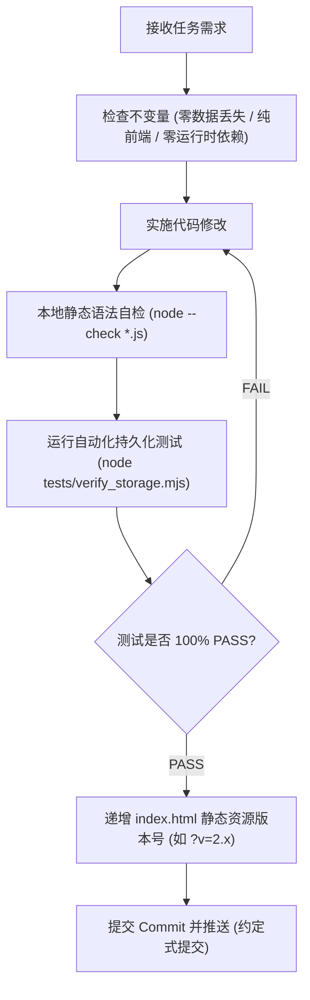

# 初中英语词表研习系统 · 智能体工作协议 (AGENTS.md)

本文件是本项目（`english-vocab-7a`）中所有 AI Agent（包括 Antigravity、Claude、Cursor、Codex 等本地与云端自主智能体）的最高架构契约与工作准则。
任何 AI Agent 在接入本仓库进行功能迭代、算法调优、词库维护或故障排查时，**必须严格遵守本协议中声明的所有不变量与红线约束**。

---

## 零、 核心工程定位与最高红线 (Core Invariants)

### 1. 架构定位：纯前端零依赖、极速静态工作台
- **零运行时 NPM 依赖（Zero Runtime Dependency）**：本项目为纯原生标准 ES6 模块化单页系统，生产环境严禁引入任何重量级前端框架（React/Vue/Webpack/Vite 构建链）。开箱即用，直连浏览器原生标准。
- **纯静态边缘部署**：原生兼容 GitHub Pages、Cloudflare Pages 等静态托管环境，所有业务逻辑均在客户端离线运行。

### 2. 最高数据红线：绝对零数据丢失承诺 (Zero Data Loss)
- **严禁物理清空存储**：任何代码中严禁写入 `localStorage.clear()`、`localStorage.removeItem()` 或删除 `IndexedDB` 数据库的破坏性逻辑。
- **启动自检与双轨双写 (Dual-Write & Legacy Fallback)**：
  - 持久化层必须维护 `IndexedDB`（主数据库 `VocabLearnerDB_7a`）与 `localStorage`（双重安全镜像）的双写机制；
  - 遇到未知异常或受限环境（如无痕模式），必须自动透明降级至 `localStorage`，确保用户背诵记录永远可读可写；
  - 启动阶段执行自愈式迁移，且必须永远保留带时间戳的只读冷备快照（`sm2_vocab_progress_7a_backup_pre_idb`）。

### 3. 音频与网络弹性铁律 (Audio & Network Resilience)
- **严禁对第三方音频做前端跨域 `fetch`**：有道发音服务器（`dict.youdao.com`）未配置 CORS 响应头。前端严禁通过 JS `fetch` 方式请求音频，必须使用 `<audio>` 标签并结合 `audioPool` 内存对象池进行复用播放，彻底避免控制台 CORS 报错。
- **离线语音兜底**：网络断开或音频加载失败时，必须无缝且静默降级为系统原生 `window.speechSynthesis` 语音合成。

---

## 一、 项目拓扑与关键文件索引

| 关键路径 | 角色与职责 | 维护注意要点 |
| :--- | :--- | :--- |
| `index.html` | 单页主入口、DOM 结构与视图容器 | 脚本引入带有缓存清除查询参（如 `js/app.js?v=2.4`），版本变更时递增 |
| `js/app.js` | 主控制器、视图路由、DOM 交互与事件调度 | 负责启动自检引导、背诵批次控制、2秒沉淀倒计时及视图切换 |
| `js/storage.js` | 持久化核心层（IndexedDB + In-Memory 缓存 + 双写保底） | 对外保持 100% 同步接口兼容，内存快速响应，后台异步持久化 |
| `js/sm2.js` | SuperMemo-2 经典记忆衰减与间隔重复算法 | 计算下一次到期时间、EF 简易度因子修正及 Leech（遗忘≥4次）判定 |
| `js/audio.js` | 音频发音控制模块与内存池 | 维护 `audioPool`，负责英音/美音切换及断网系统语音降级 |
| `js/export.js` | 学情备份导入/导出及 AI 诊断 Prompt 生成引擎 | 生成包含艾宾浩斯留存率、8 单元掌握度矩阵与高频薄弱词的结构化 Prompt |
| `data/vocab-7a.json` | 沪教牛津 7A 官方考纲核心单词库（256 词） | 包含单词、音标、词性、精准释义、教材语境例句与单元标记 |
| `data/phrases-7a.json`| 沪教牛津 7A 重点课文短语词组库（71 条） | 包含课文重点搭配、中文释义与单元归属，总考纲词条为 327 项 |
| `css/style.css` | Minimal Notion 风格极简设计样式表 | 包含深浅外观、响应式移动端适配、热力图网格与 Anki 统计图表 |
| `_headers` | Cloudflare Pages HTTP 安全与 CSP 响应头 | 包含 `connect-src`、`media-src` 与 `X-Frame-Options` 等安全策略 |
| `tests/verify_storage.mjs` | Node.js 本地自动化存储自检与迁移不变式测试 | 任何影响持久化逻辑的改动必须运行该测试通过 |

---

## 二、 SM-2 记忆算法与学情指标规范

1. **间隔与轮次计算规则**：
   - 评分标准（Quality）：`1: 重来 (Again)`, `3: 困难 (Hard)`, `4: 良好 (Good)`, `5: 简单 (Easy)`；
   - 评分 `< 3` 时：轮次重置为 `0`，复习间隔重置为 `1` 天，累计遗忘数 `lapses + 1`；
   - 评分 `≥ 3` 时：轮次 `+ 1`，首轮间隔为 `1` 天，次轮为 `3/6` 天，后续按 `interval * efactor` 几何递增；
   - 简易度因子（Ease Factor）：初始值基准为 `2.50`，范围严格约束在 `[1.30, 3.00]` 之间。
2. **卡片记忆状态分类（Anki 工业标准）**：
   - **Mature（成熟卡片）**：`interval >= 21` 天；
   - **Young（初熟卡片）**：`interval < 21` 天 且 `repetitions >= 1`；
   - **Learning（重学/学习中）**：`repetitions === 0` 且有过自测记录或遗忘记录；
   - **New（未学习新卡）**：无任何自测记录。
3. **重点难词（Leech 机制）**：
   - 遗忘次数 `lapses >= 4` 的词汇自动被打上 `isLeech = true` 标签；
   - 导航栏专属红点标记，支持一键进入重点难词攻坚会话；
   - 用户可手动一键“解除难词标记”，将 EF 重置为 2.5 并重新纳入正常循环。

---

## 三、 AI Agent 开发行为规范与工作流

当 AI Agent 在本项目中执行任务时，必须严格执行以下闭环工作流：



### 1. 严格测试后提交原则
在声明任何任务完成前，必须确保以下自动化验证命令在终端执行通过：
```bash
# 1. 运行存储引擎无损测试
node tests/verify_storage.mjs

# 2. 检查全部 JavaScript ES 模块语法
node --check js/app.js && node --check js/storage.js && node --check js/audio.js && node --check js/export.js && node --check js/sm2.js
```

### 2. Git 提交信息规范 (Conventional Commits)
遵循语义化提交：
- `feat(storage): ...` - 持久化或数据层特性
- `feat(ui): ...` - 界面交互或视图特性
- `fix(audio): ...` - 音频或播放问题修复
- `fix(stats): ...` - 统计看板或指标算法修复
- `docs(...)` - 文档或协议更新
